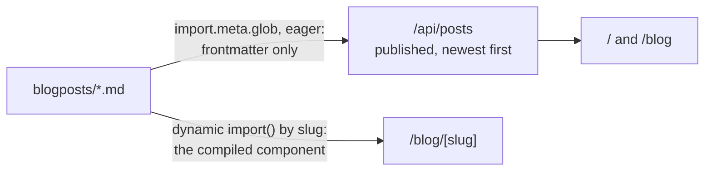

How the site is built and why, for the rules in [`CLAUDE.md`](CLAUDE.md) that follow from it. The directories themselves are listed in the [root README](../README.md#repository-layout).

## One app, one edge function

The site is a single SvelteKit app. There is no database, no auth and no CMS: a blog post is a Markdown file in git, and content ships by pushing a commit.

It deploys to Netlify through `adapter-netlify`, configured in [`vite.config.ts`](../vite.config.ts) with `edge: true` and `split: false`. Together those make the whole app **one Netlify Edge Function**, and an edge function runs on Netlify's Deno-based, web-standard runtime rather than on Node - which is why a `+server.ts` or `+page.server.ts` must not reach for Node built-ins. The adapter's own comment in the config notes that `split` cannot be used with `edge` anyway. [`netlify.toml`](../netlify.toml) runs `pnpm run build` and publishes `build/`.

`/api/healthcheck` returns `{ Status: 'OK' }` for external uptime monitoring; nothing in the app calls it.

## Almost nothing is prerendered

Only `/contact` and `/success` opt in, each with `export const prerender = true` in its `+page.ts`. Everything else - `/`, `/blog`, `/blog/[slug]`, `/projects`, `/about` and both API routes - renders per request.

The `prerender: { crawl: true, entries: ['*'] }` block in `vite.config.ts` reads as though it prerenders everything, and it does not: it widens what the crawler _visits_, and a page is still baked out only when it opts in. After a build, `.netlify/edge-functions/manifest.json` shows what actually was.

## Configuration lives in `vite.config.ts`

There is no `svelte.config.js`. What it used to hold - the Netlify adapter, the runes `compilerOptions`, the `prerender` block, the mdsvex `preprocess` and `extensions` - is passed to the `sveltekit()` plugin in `vite.config.ts`. That is what `sv create` scaffolds today, and Kit accepts it because `sveltekit()` takes Kit's configuration and the plugin's options as one object, so Kit-level keys sit flat beside the plugin's rather than nested under `kit`. `svelte-check` and `eslint-plugin-svelte` read it from there, and [`eslint.config.js`](../eslint.config.js) imports no Svelte config.

## Blog posts

`blogposts/*.md` is the content store, deliberately outside `src/`. mdsvex preprocesses it, and `extensions: ['.svelte', '.svx', '.md']` makes every `.md` file a Svelte component, so a post may contain markup.

Two routes read that directory, in two different ways, and share no code:

- [`/api/posts`](../src/routes/api/posts/+server.ts) reads only each module's `metadata` - the frontmatter - keeps the posts marked `published`, and sorts them newest first. This is the list.
- [`/blog/[slug]`](../src/routes/blog/[slug]/+page.ts) imports one file by slug and renders its default export. This is the body.

**The slug is the filename**, never a frontmatter field: `parseMarkdownFiles()` derives it from the path and merges it into the metadata, so renaming a file changes its URL.

**`published: false` hides a post from the list, not from the web.** `/blog/[slug]` imports by slug without consulting the flag, so an unpublished post stays reachable by direct link. Anything that must actually stay private belongs on an unmerged branch.

Frontmatter must satisfy the `Post` type in [`src/lib/types/index.ts`](../src/lib/types/index.ts): `title`, `date`, `description`, `img`, `img_transparent` and `published`. `img` is a URL into `static/` (`/media/blog/<slug>/…`), not a Vite import, so those images are served verbatim and are neither hashed nor optimised - unlike the images under `src/lib/assets/`, which are imported and get hashed filenames.

## Two Markdown renderers, on purpose

mdsvex compiles `blogposts/*.md` **at build time**. `svelte-markdown` renders **at runtime**, inside [`post.svelte`](../src/lib/components/post.svelte), because the project blurbs on `/projects` are written as inline string props rather than files. mdsvex suits content that lives in git; `svelte-markdown` only strings that do not exist until runtime.

## Styling

Tailwind v4 runs through `@tailwindcss/vite`, with **no `tailwind.config` file**. The theme is an `@theme` block in [`src/routes/layout.css`](../src/routes/layout.css): `--color-accent-color`, `--color-accent-color-lighter`, `--color-background` and `--color-window-gray`.

**That same file is the global element stylesheet, and the blog depends on it.** Bare `h1`–`h4`, `a`, `p`, `ul`, `pre`, `code`, `img`, `input`, `textarea` and `button` are styled there, and that is the only reason mdsvex output - plain HTML carrying no classes - looks right. Narrowing those selectors into component scope would unstyle every post.

A component `<style>` block that uses Tailwind needs `@reference "#app.css"`. `#app.css` is a subpath import declared under `"imports"` in [`package.json`](../package.json), resolving to `src/routes/layout.css`, so the reference does not depend on where the component sits; Prettier's `tailwindStylesheet` in [`prettier.config.js`](../prettier.config.js) points at the same file, so class sorting knows the custom colours. The commented-out form in `src/routes/contact/+page.svelte` still carries an old `@reference "../../app.css"`; that path no longer exists, so uncommenting it as-is will not build.

Internal links go through `resolve()` from `$app/paths`, which `eslint-plugin-svelte`'s `svelte/no-navigation-without-resolve` enforces. `post.svelte` disables the rule at the top of the file because its links are external GitHub URLs - a local disable keeps the rule working everywhere else.
